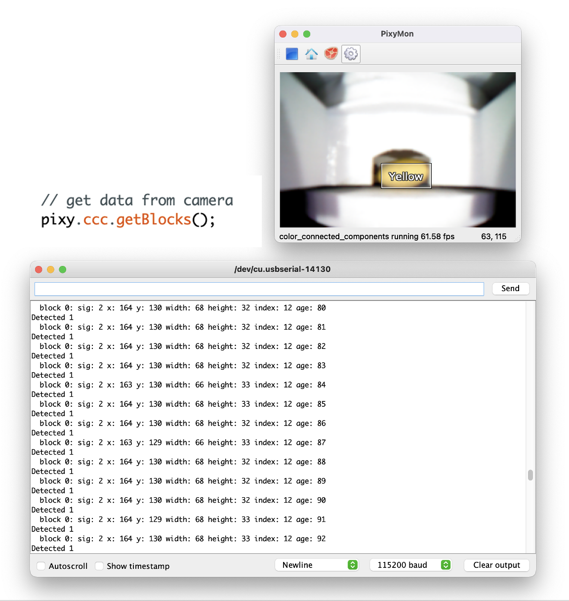
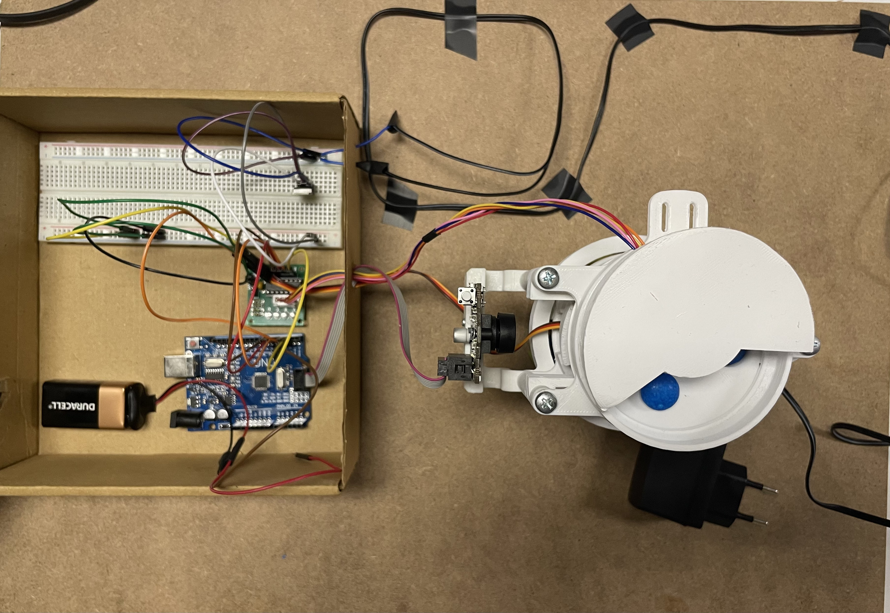

# M-M-Sorter-w-Pixy
M&amp;M Sorting Machine

# Candy Sorting Machine with Pixy CMUcam5 and Arduino

This project showcases my proficiency in C++ programming and my ability to integrate hardware components like the Pixy CMUcam5, stepper motor, and servo motor to create a candy sorting machine.

## Gallery





## Project Highlights

- Utilizes C++ programming language for Arduino development.
- Demonstrates hardware integration skills with Pixy CMUcam5, stepper motor, and servo motor.
- Implements logic for candy detection and color-based sorting.
- Keeps track of the number of candies sorted by color.
- Uses clear comments to explain the purpose of different parts of the code.

## Code Sample

```cpp
// ... (code to initialize hardware components and variables)

void loop() {
  int j = 0;
  
  // get data from camera
  pixy.ccc.getBlocks();
  
  // rotate stepper motor/feeder until candy is detected
  if (InChamber == false) {
    myStepper.step(200);
  }
  
  // stop motor and sort if candy detected
  if (pixy.ccc.numBlocks) { 
    myStepper.step(0);
    
    InChamber = true;
    int color = pixy.ccc.blocks[j].m_signature;
    
    Sort(color);
  }
  
  // ... (printing and displaying sorted candy counts)
}

void Sort(int ID){
  // Sorting function controls dropping/dispensing sequence
  switch (ID){
    case 1: myStepper.step(-1050); myServo.write(80); InChamber = false; orangeCount++; Count++;
    // ... (cases for different candy colors)
  }
}
```

## Hardware Setup

1. Connect the Pixy CMUcam5 to the Arduino's ICSP SPI port.
2. Connect the stepper motor to the appropriate pins on the Arduino.
3. Connect the servo motor to the designated pin on the Arduino.
